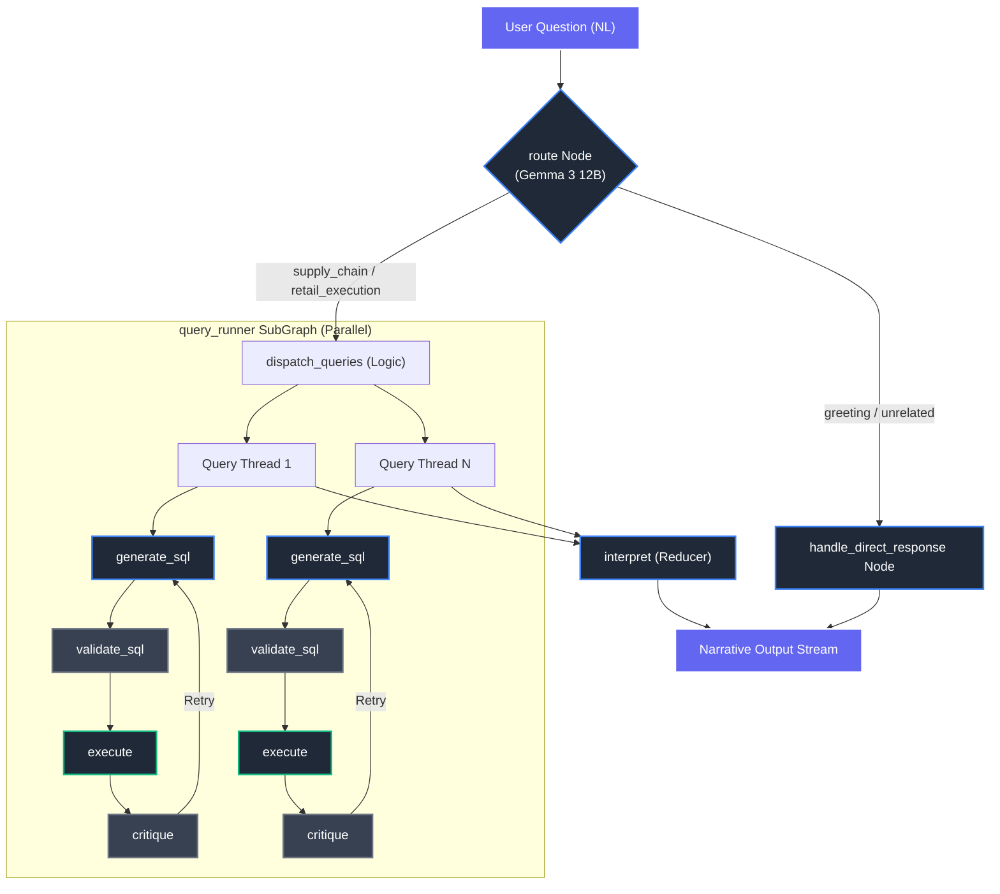
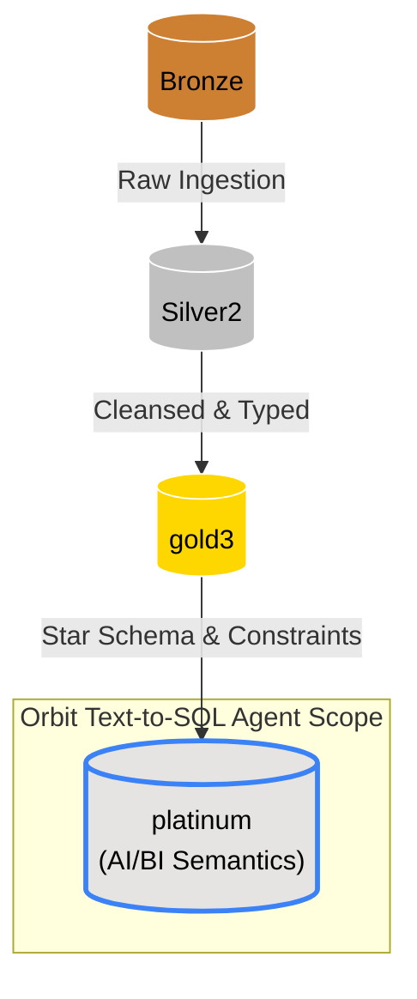
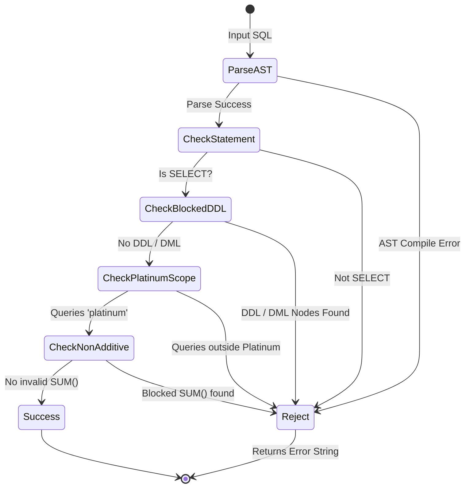

# Orbit Text-to-SQL-to-Insight Agent

**System Documentation** · Orbit Enterprise Analytics Platform ·

---

## Table of Contents

1. [System Overview](#1-system-overview)
2. [Architecture](#2-architecture)
3. [Configuration](#3-configuration)
4. [LLM Model Topology](#4-llm-model-topology)
5. [Agent Graph: Node Reference](#5-agent-graph-node-reference)
6. [SQL Safety & Semantic Validation](#6-sql-safety--semantic-validation)
7. [Platinum Semantic Schema (Agent Data Access)](#7-platinum-semantic-schema-agent-data-access)
8. [Non-Additive Column Registry](#8-non-additive-column-registry)
9. [Conversation History Management](#9-conversation-history-management)
10. [Tracing & Observability](#10-tracing--observability)
11. [MLflow Deployment Lifecycle](#11-mlflow-deployment-lifecycle)
12. [Serving Endpoint & Secret Management](#12-serving-endpoint--secret-management)
13. [Runtime Constants Quick Reference](#13-runtime-constants-quick-reference)

---

## 1. System Overview

Orbit is a production-grade, conversational Text-to-SQL-to-Insight agent designed for pharmaceutical commercial analytics. It translates a natural language question posed by a business user or C-suite executive into a validated, safely executed SQL query against the enterprise Platinum semantic layer, and then synthesises the query results into a concise, commercially-oriented narrative response.

The agent is deployed as an **MLflow `ResponsesAgent`** on a **Databricks Model Serving** endpoint, exposing an **OpenAI-compatible streaming interface** (`/invocations`). The end-to-end pipeline is orchestrated by a compiled **LangGraph** state machine.

### Pipeline Summary



---

## 2. Architecture

### 2.1 Medallion Layer Context

Orbit queries exclusively against the **`zydus.platinum`** schema — the top tier of the enterprise Databricks Medallion architecture. The Platinum layer exposes three pre-computed Materialized Views that join and enrich the underlying `gold3` Star Schema facts and dimensions, pre-calculating complex window functions such as month-on-month growth, year-on-year growth, and national-level attainment percentages.



### 2.2 Technology Stack

| Component | Technology |
|---|---|
| Orchestration | LangGraph `StateGraph` |
| LLM interface | `databricks-langchain` (`ChatDatabricks`) |
| SQL validation | `sqlglot >= 25.0` (AST-based) |
| SQL execution | `databricks-sql-connector >= 3.0.0` |
| Deployment | MLflow `ResponsesAgent` + Databricks Model Serving |
| Secret management | Databricks Secret Scope (`orbit-agent-secrets`) |
| Registry | Unity Catalog (`zydus.models.orbit_text_to_sql_agent`) |

---

## 3. Configuration

The following constants are defined at the top of the deployment notebook and are injected into the serving endpoint as environment variables at deploy time.

```python
CATALOG_NAME             = "zydus"
SCHEMA_NAME              = "models"

LLM_ROUTER_ENDPOINT_NAME = "databricks-gemma-3-12b"
LLM_SQL_ENDPOINT_NAME    = "databricks-meta-llama-3-3-70b-instruct"

SQL_WAREHOUSE_ID         = "ee29bea9c8bf4e78"

SECRET_SCOPE             = "orbit-agent-secrets"
SECRET_KEY_PAT           = "SQL_PAT"
```

> [!IMPORTANT]
> The Personal Access Token (`SQL_PAT`) is never resolved in notebook scope. It is always referenced via the Databricks Secrets API using the double-brace syntax: `{{secrets/orbit-agent-secrets/SQL_PAT}}`. The raw PAT value is injected exclusively at the serving endpoint container level.

---

## 4. LLM Model Topology

Orbit uses a **two-endpoint, three-role** LLM design, separating lightweight routing from expensive generation and narration. All models are lazily initialised at first graph execution to avoid failed imports during MLflow log-time validation.

| Role | Endpoint | Temperature | Purpose |
|---|---|---|---|
| `_llm_route` | `databricks-gemma-3-12b` | 0.0 | Cheap, fast intent classification |
| `_llm_sql` | `databricks-meta-llama-3-3-70b-instruct` | 0.0 | Deterministic SQL generation |
| `_llm_narrate` | `databricks-meta-llama-3-3-70b-instruct` | 0.2 | Creative-constrained C-suite narration |

> [!TIP]
> The narration LLM endpoint can be independently overridden at serve time by setting the `LLM_NARRATE_ENDPOINT_NAME` environment variable on the serving endpoint, without requiring a model re-registration.

---

## 5. Agent Graph: Node Reference

The LangGraph state machine is compiled from a `StateGraph(AgentState)` and executed as a single, synchronous pass per user request.

### State Schema (`AgentState` - Parent)

| Field | Type | Description |
|---|---|---|
| `question` | `str` | Current user question |
| `chat_history` | `list` | Pruned prior conversation turns |
| `messages` | `list` | Internal trace of SQL attempts |
| `route` | `Optional[str]` | Router classification result |
| `query_results` | `Annotated[list, operator.add]` | Reducer aggregating parallel SubGraph results |
| `final_answer` | `Optional[str]` | Final narrative response |

### State Schema (`QueryState` - SubGraph)

| Field | Type | Description |
|---|---|---|
| `route` | `Optional[str]` | View executing in this parallel thread |
| `sql_query` | `Optional[str]` | Generated and limit-enforced SQL |
| `sql_result` | `Optional[list]` | List of dicts from execution |
| `error` | `Optional[str]` | Current error string, reset on retry |
| `attempt_count` | `int` | Retry counter, maximum 2 |
| `retryable` | `Optional[bool]` | Whether the error is transient |

---

### Node: `route`

**LLM**: Gemma 3 12B · **Temperature**: 0.0

Classifies the incoming question into one of six intents, selecting the most appropriate Platinum view for SQL generation. 

**Keyword Fast-Path**: To save 300-600ms of latency, the router uses an initial deterministic keyword check for high-confidence terms (e.g., "sell-out", "pipeline"). Bypassing the LLM for most direct queries. 

On multi-turn conversations without explicit keywords, the router extracts the prior human turn from history to detect domain shifts in a single combined JSON extraction call.

| Output Category | Meaning | Downstream |
|---|---|---|
| `supply_chain` | Wholesaler stock, primary/secondary sales, pipeline, attainment, backorders | `mv_ai_supply_chain_360` |
| `retail_execution` | Pharmacy sell-out, rep calls, written value, rep performance | `mv_retail_execution_and_rep_impact` |
| `market_execution` | Geographic suburb analysis, dispensing doctors, territory | `mv_ai_market_execution_geo` |
| `<variable>` | The router can return a comma-separated list of any views for cross-domain queries | Dispatches all requested views in parallel |
| `greeting` | Simple conversational greetings | `handle_direct_response` |
| `unrelated` | Non-pharmaceutical or non-data questions | `handle_direct_response` |

**Context Pruning Logic**: If the domain shifts between turns (e.g., `supply_chain` to `retail_execution`), the chat history is automatically cleared to prevent prior SQL context from polluting the new domain's prompt.

---

### Node: `generate_sql`

**LLM**: LLaMA 3.3 70B Instruct · **Temperature**: 0.0

Translates the natural language question into valid Databricks SQL. On retry attempts (`attempt_count > 0`), the node injects the prior failed SQL, the full error message, and the critique reason into the prompt to guide self-correction.

**Post-processing pipeline**:
1. Strip markdown fences that the LLM may emit despite explicit instructions.
2. Apply `_enforce_limit()` — smart AST-based LIMIT injection.

**Retry context injected on failure**:

```
PREVIOUS ATTEMPT FAILED (attempt N/2):
SQL: <prior SQL>
Error: <error message>
Critique: <critique reason>
Fix these issues in your new SQL.
```

---

### Node: `validate_sql`

**LLM**: None (static, zero network cost)

Pure AST-level safety gate using `sqlglot`. Runs before every execution attempt.

| Check | Method | Failure Message |
|---|---|---|
| SQL syntax parsable | `sqlglot.parse_one()` | `SQL Syntax Error during validation: <detail>` |
| Statement is SELECT | AST type check | `SQL must be a SELECT statement.` |
| No DDL/DML nodes | AST node scan | `SQL contains blocked DDL/DML command type.` |
| References `platinum` schema | DB qualifier + string fallback | `SQL must query a platinum view.` |
| No `SUM()` on non-additive columns | `find_all(Sum)` + column name registry | `Semantic error: SUM() applied to non-additive column '...'` |

---

### Node: `execute`

**LLM**: None

Opens a JDBC connection to the Databricks SQL Warehouse using a **lazy singleton**. The initial handshake takes 2-5 seconds, but subsequent queries within the same container execution reuse the connection, dramatically cutting latency. Connection credentials (`SQL_PAT`, `SQL_WAREHOUSE_ID`) are resolved at runtime.

A hard cap of **2,500 rows** is enforced at the connector level.

**Error Tagging**: Exceptions are caught and tagged via string matching. Transient Databricks errors (timeout, gateway) return `retryable: True`, while syntax and schema errors return `retryable: False`, immediately terminating the LLM self-correction loop.

**Column Projection**: Before passing rows to state, the node uses `sqlglot` to parse the `SELECT` clause and drop unused columns from the payload, typically saving 60-80% of context tokens for downstream narration.

If the state already carries an error from `validate_sql`, execution is skipped entirely.

---

### Node: `critique`

**LLM**: None (heuristic, zero network cost)

Fast, deterministic quality gate on the execution result.

| Condition | Critique Result |
|---|---|
| State contains error | `FAIL: <error>` |
| Result is 0 rows | `FAIL: Query returned 0 rows. Filters may be too restrictive...` |
| All column values are `NULL` for single row | `FAIL: Query returned a single row with all NULL values.` |
| Result contains > 20 columns | `FAIL: Query returned {N} columns — likely SELECT * was used.` |
| Single-row result with any column value > 1 × 10¹⁰ | `FAIL: Column '...' returned implausibly large value.` |
| All other cases | `GOOD` |

**Retry routing**: If critique returns `FAIL` and `attempt_count < 2` (and the error is `retryable`), the graph loops back to `generate_sql`. If `attempt_count == 2` or `retryable` is False, the graph proceeds to `interpret` with the error.

---

### Node: `interpret`

**LLM**: LLaMA 3.3 70B Instruct · **Temperature**: 0.2

Generates a concise, accurate, commercially-oriented executive narrative from the SQL result JSON. Data payloads exceeding **28,000 characters** are truncated before narration to avoid context window overflow.

**Narration format rules**:

| Data Type | Format |
|---|---|
| Monetary values | South African Rand — `R1,234,567` |
| Volume / unit values | Plain number with commas — `1,234,567 units` |
| Percentages | Percentage symbol — `87.3%` |
| Days | Plain number — `45 days` |
| Ratios | Plain decimal — `0.46` |

Additional constraints: maximum 400 words, executive flowing prose only, no bullet points, no hallucination, flag risks explicitly.

---

### Node: `handle_direct_response`

**LLM**: Gemma 3 12B · **Temperature**: 0.0

Short-circuits the SQL pipeline for `greeting` and `unrelated` route classifications. Generates a polite conversational response or a scope-decline message using the lightweight routing model.

---

## 6. SQL Safety & Semantic Validation

### 6.1 Smart LIMIT Injection (`_enforce_limit`)
 
-Uses `sqlglot` AST parsing to classify a query and inject the correct LIMIT if none is present without disrupting subqueries or CTEs.

| Query Type | Injected LIMIT |
|---|---|
| Aggregation / GROUP BY / DISTINCT | `2500` |
| Granular row retrieval | `100` |

If AST parsing fails, a naive regex fallback appends `LIMIT 100` as a safety net.

### 6.2 AST Validation (`_validate_sql`)

Leverages the `sqlglot` Databricks dialect parser to build a full AST before any network call, ensuring:
- **No false positives on string literals**: A query mentioning "DROP" in a filter value will not be blocked because checks operate on AST node types, not raw strings.
- **Non-additive column guard**: Detects `SUM()` wrapping any column name in the non-additive registry.
- **Platinum-only scope**: Verifies DB qualifier presence or falls back to string-level check.



---

## 7. Platinum Semantic Schema (Agent Data Access)

**Dynamic Prompt Assembly**: To prevent token bloat, the agent dynamically constructs the system prompt in the `generate_sql` node, injecting only the specific Platinum view selected by the router. 

**Fuzzy Matching**: The prompt applies a strict global rule commanding the LLM to use `ILIKE '%...%'` for string matching on dimensions (e.g., `product_name`, `customer_name`), eliminating false negatives from case-sensitivity or incomplete names. The prompt is anchored with **canonical few-shot SQL examples** to guide the LLM efficiently around complex subquery filters (e.g. max date checks) and fuzzy string searches.

The agent has **no access** to any table, view, or schema outside of `zydus.platinum`. It cannot query raw Silver2 data, Gold dimension tables, or any other Databricks catalog. This section documents every column the agent can observe, how each is computed, and where known data quality boundaries or analytical limitations exist.

> [!IMPORTANT]
> Orbit queries exclusively against `zydus.platinum`. Any question requiring data not present in the three views below is outside the agent's answerable scope and will result in an empty result set or a graceful decline.

---

### View 1: `zydus.platinum.mv_ai_supply_chain_360`

**Full Name**: `zydus.platinum.mv_ai_supply_chain_360`  
**Grain**: One row per `month_start_date × nappi_code_9 × customer_account (wholesaler ship-to)`  
**Source tables**: `gold3.fact_sales_360_monthly`, `gold3.dim_product_gold`, `gold3.dim_customer_360_gold`, `gold3.fact_inventory_health_daily`, `gold3.fact_product_targets_monthly`  
**Refresh**: Materialized View — scheduled daily cron (`Africa/Johannesburg`)  
**Purpose**: Primary analytical surface for all wholesaler-level supply chain interrogation. Covers the complete primary/secondary supply loop, financial metrics, inventory health, national target attainment, and pre-computed time-series growth indicators.

#### Identity & Product Columns

| Column | Type | Description |
|---|---|---|
| `month_start_date` | DATE | First calendar day of the reporting month |
| `nappi_code_9` | STRING | Pack-level product identifier — the base query grain |
| `nappi_code_formulation` | STRING | Molecule-level rollup key, derived by stripping the trailing 3-digit pack suffix from `nappi_code_9` |
| `product_name` | STRING | Full commercial product name |
| `brand_franchise` | STRING | Brand family grouping |
| `therapeutic_class_l1` | STRING | Therapeutic category — highest classification level available |
| `schedule_tier` | STRING | Regulatory schedule (`S0`–`S8`). Values of `S3` and above require a prescription |
| `ean_code` | STRING | EAN barcode identifier from the product master |

#### Customer & Wholesaler Columns

| Column | Type | Description |
|---|---|---|
| `customer_account` | STRING | Wholesaler ship-to account number — the primary join key |
| `customer_name` | STRING | Wholesaler entity name |
| `parent_group_name` | STRING | Corporate parent group name, used for national group-level rollups and rebate tracking |
| `country` | STRING | Country of the wholesaler |
| `is_local` | BOOLEAN | `TRUE` = local wholesaler; `FALSE` = international |
| `has_bill_role` | BOOLEAN | Whether this account can receive billing |
| `has_ship_role` | BOOLEAN | Whether this account can receive shipments |
| `customer_first_seen_at` | DATE | Earliest date this wholesaler account appeared in source data |
| `customer_last_seen_at` | DATE | Most recent activity date for this wholesaler account |

#### Primary Sales Columns (Manufacturer → Wholesaler)

| Column | Type | Description |
|---|---|---|
| `primary_ordered_vol` | BIGINT | Units ordered by the wholesaler |
| `primary_vol_units` | BIGINT | Units actually shipped and revenue-recognised (`qty_moved`) |
| `primary_unfulfilled_vol` | BIGINT | `MAX(0, ordered − shipped)`. Always ≥ 0 — safeguarded against negative credit note artefacts |
| `primary_val_net` | DECIMAL | Net revenue from primary shipments (ZAR), excluding VAT and discounts |
| `primary_discount_val` | DECIMAL | Total discount value applied to primary invoices (ZAR) |
| `primary_vat_val` | DECIMAL | Total VAT on primary sales (ZAR) |
| `primary_gross_val` | DECIMAL | Total invoice value inclusive of VAT (ZAR) |
| `primary_credit_note_vol` | BIGINT | Units returned via credit notes (`trans_type = 'CREDIT'`) |
| `primary_credit_note_val` | DECIMAL | Value of credit note returns (ZAR) |

#### Secondary Sales Columns (Wholesaler → Pharmacy/Doctor)

| Column | Type | Description |
|---|---|---|
| `secondary_vol_units` | BIGINT | Units sold by the wholesaler to downstream pharmacies or dispensing doctors (excl. returns) |
| `secondary_val_net` | DECIMAL | Revenue from secondary sell-through (ZAR) |
| `secondary_return_vol` | BIGINT | Units returned from pharmacy or doctor back to the wholesaler |
| `secondary_return_val` | DECIMAL | Value of secondary returns (ZAR) |
| `bonus_vol_units` | BIGINT | Zero-revenue bonus/trade units shipped by the wholesaler alongside paid stock |

#### Integrated Supply Chain Metrics

| Column | Type | Description |
|---|---|---|
| `pipeline_stock_change` | BIGINT | `primary_vol_units − secondary_vol_units`. Positive = wholesaler building stock; Negative = depleting pipeline inventory |
| `net_selling_price` | DECIMAL | `secondary_val_net / secondary_vol_units` — pure revenue per paid unit, explicitly excluding bonus stock volumes |
| `effective_unit_price_incl_bonus` | DECIMAL | `secondary_val_net / (secondary_vol_units + bonus_vol_units)` — deflated revenue per total physical unit moved |
| `wholesaler_primary_ssd_variance_ratio` | DECIMAL | `(primary_vol_units − secondary_vol_units) / secondary_vol_units` for **this specific wholesaler row**. Positive = this wholesaler is taking more stock than it is selling |
| `national_primary_ssd_variance_ratio` ⚠ | DECIMAL | **NON-ADDITIVE.** Pre-computed national KPI via window function: `(SUM(primary) − SUM(secondary)) / SUM(secondary)` partitioned by `month_start_date × nappi_code_9`. Repeated on every wholesaler row — a high positive value indicates national oversupply or channel-stuffing risk |

#### Inventory Health Columns (Latest Monthly Snapshot)

Inventory values are sourced from `fact_inventory_health_daily` by selecting the most recent daily snapshot within each month using `ROW_NUMBER() OVER (PARTITION BY month, nappi_code_9, wholesaler ORDER BY snapshot_date DESC)`.

| Column | Type | Description |
|---|---|---|
| `stock_on_hand_qty` | INT | Units held in the wholesaler warehouse at the latest snapshot date in this month |
| `backorder_qty` | INT | Units currently on backorder |
| `backorder_val_at_risk` | DECIMAL | Monetary value of outstanding backorders (ZAR) |
| `avg_daily_sales_90d` | DECIMAL | 3-month rolling average daily secondary sell-out velocity. PRD-aligned baseline; smooths promotional volatility |
| `avg_daily_sales_270d` | DECIMAL | 9-month rolling average daily velocity. **Limitation**: bounded by pipeline execution date — deep historical backfills may truncate the available calculation window |
| `stock_cover_days` | DECIMAL | `stock_on_hand_qty / avg_daily_sales_90d`. `NULL` implies zero velocity (Dead Stock) |
| `stock_status` | STRING | Rule-based classification: `Dead Stock` (zero velocity), `Risk/Opportunity` (< 30 days cover), `Ideal` (30–60 days), `Oversupply Risk` (> 60 days) |

#### Target Attainment Columns (National)

Targets are sourced from `fact_product_targets_monthly` and joined at `month_start_date × nappi_code_9`. Because targets are set at national product-month level, the attainment percentages are computed by window-summing actuals across all wholesaler rows and dividing by the single national target. This means all four attainment columns are **repeated identically on every wholesaler row for the same nappi_code_9 and month**.

| Column | Type | Description |
|---|---|---|
| `national_primary_target_vol` | BIGINT | National volume target for primary sell-in |
| `national_primary_target_sales` | DECIMAL | National R-value target for primary sell-in (ZAR) |
| `national_secondary_target_vol` | BIGINT | National volume target for secondary sell-through |
| `national_secondary_target_sales` | DECIMAL | National R-value target for secondary sell-through (ZAR) |
| `national_primary_vol_attainment_pct` ⚠ | DECIMAL | **NON-ADDITIVE.** `SUM(primary_vol_units) / national_primary_target_vol` — national ratio; never `SUM()` |
| `national_primary_val_attainment_pct` ⚠ | DECIMAL | **NON-ADDITIVE.** `SUM(primary_val_net) / national_primary_target_sales` — national R-value ratio |
| `national_secondary_vol_attainment_pct` ⚠ | DECIMAL | **NON-ADDITIVE.** `SUM(secondary_vol_units) / national_secondary_target_vol` |
| `national_secondary_val_attainment_pct` ⚠ | DECIMAL | **NON-ADDITIVE.** `SUM(secondary_val_net) / national_secondary_target_sales` |

#### Time-Series Growth Columns

| Column | Type | Description |
|---|---|---|
| `primary_vol_mom_growth` | DECIMAL | `(current_month − prior_month) / prior_month` partitioned by `nappi_code_9 × customer_account`. `NULL` if no prior month row exists |
| `primary_vol_yoy_growth` | DECIMAL | `(current_month − month_12_prior) / month_12_prior` partitioned by `nappi_code_9 × customer_account`. Requires 12 months of history; `NULL` for new products |

#### Known Limitations — View 1

> [!WARNING]
> - **National KPIs repeat at wholesaler grain.** Columns prefixed `national_` are pre-computed window aggregates attached to every row. Aggregating them with `SUM()` produces values that are a multiple of the correct national figure. Always use `MAX()` or filter to a single row per `nappi_code_9 × month`.
> - **Growth columns require history depth.** `primary_vol_yoy_growth` returns `NULL` for any product-wholesaler combination with fewer than 12 months of contiguous data.
> - **Inventory snapshot is end-of-month.** Stock-on-hand reflects the final available daily snapshot within the month, not a true point-in-time average.
> - **270-day velocity window.** `avg_daily_sales_270d` may be truncated for historically short-dated pipeline loads — treat with caution for newly onboarded wholesalers.

---

### View 2: `zydus.platinum.mv_retail_execution_and_rep_impact`

**Full Name**: `zydus.platinum.mv_retail_execution_and_rep_impact`  
**Grain**: One row per `month_start_date × retail_customer_account × nappi_code_9`  
**Source tables**: `gold3.fact_retail_sales_monthly`, `gold3.fact_rep_calls`, `gold3.dim_customer_360_gold`, `gold3.dim_product_gold`, `gold3.dim_rep_gold`  
**Refresh**: Materialized View — scheduled daily cron (`Africa/Johannesburg`)  
**Purpose**: Directly correlates pharmacy and dispensing-doctor sell-out volumes with CRM field force activity in the same month. Enables rep-impact analysis, call-quality measurement, and identification of high-performing or under-serviced accounts.

#### Identity Columns

| Column | Type | Description |
|---|---|---|
| `month_start_date` | DATE | First calendar day of the reporting month |
| `retail_customer_account` | STRING | Medpages code identifying the pharmacy or dispensing doctor |
| `retail_customer_name` | STRING | Customer entity name. **`NULL` indicates a late-arriving dimension record** — the account transacted but has not yet been resolved in `dim_customer_360_gold` |
| `country` | STRING | Country of the pharmacy or doctor |
| `town` | STRING | Town |
| `suburb` | STRING | Suburb |
| `sub_region` | STRING | Sub-region grouping |
| `region` | STRING | Regional grouping |
| `nappi_code_9` | STRING | Pack-level product identifier |
| `nappi_code_formulation` | STRING | Molecule-level rollup key |
| `product_name` | STRING | Full commercial product name |

#### Retail Sell-Out Columns (Pharmacy/Doctor)

| Column | Type | Description |
|---|---|---|
| `retail_units_sold` | BIGINT | Secondary sell-out volume received by this pharmacy or doctor, excluding returns |
| `retail_net_sales` | DECIMAL | Secondary sell-out revenue generated by this account (ZAR) |
| `retail_units_returned` | BIGINT | Units returned at the pharmacy or doctor level |
| `retail_return_value` | DECIMAL | Value of returns at the pharmacy or doctor level (ZAR) |

#### Rep Activity Columns (CRM Field Force)

Rep activity is aggregated per `month × customer_account` in a CTE using `fact_rep_calls`, then joined to the retail sell-out data via a `FULL OUTER JOIN`. This means a row may exist with rep activity but zero sales, or with sales but no rep visit recorded.

| Column | Type | Description |
|---|---|---|
| `total_rep_calls` ⚠ | BIGINT | **NON-ADDITIVE at product grain.** Total number of rep calls made to this customer in the month. This is a customer-level event — when rolling up across products, use `MAX()` instead of `SUM()` |
| `last_rep_visit_date` | DATE | Most recent date a rep visited this customer in the month |
| `total_written_value` ⚠ | DECIMAL | **NON-ADDITIVE at product grain.** Sum of all written values captured by reps visiting this customer. Use `MAX()` when aggregating across products |
| `distinct_reps_visited` ⚠ | BIGINT | **NON-ADDITIVE at product grain.** Count of unique rep codes visiting this customer in the month |
| `calls_with_written_value` ⚠ | BIGINT | **NON-ADDITIVE at product grain.** Count of rep calls where `written_value > 0` was recorded — a call quality indicator |
| `primary_rep_code` | STRING | The rep code with the highest written value for this customer and month, selected via `MAX_BY(rep_code, written_value)` |
| `primary_rep_name` | STRING | Full name of the primary rep, resolved from `dim_rep_gold` |

#### Known Limitations — View 2

> [!WARNING]
> - **Rep calls are customer-level, not product-level.** A rep visits a customer, not a specific product. Summing `total_rep_calls` across product rows for the same customer and month will multiply the call count by the number of distinct products in that account. Always use `MAX()` for any rep activity metric when a `GROUP BY nappi_code_9` is present.
> - **`retail_customer_name` may be `NULL`.** Late-arriving dimension records create rows where the Medpages code exists in the fact table but the customer name has not yet been loaded into `dim_customer_360_gold`. These rows are analytically valid for volume and rep metrics but cannot be filtered or grouped by customer name.
> - **written_value reversals are valid.** The `fact_rep_calls` table explicitly omits a non-negative constraint on `written_value` to accommodate legitimate CRM reversal entries. `total_written_value` may therefore be negative for accounts with reversed prescriptions.
> - **`primary_rep_code` reflects written value only.** The "primary" rep is the one who recorded the highest written value, not necessarily the rep who made the most visits or achieved the highest sell-out.

---

### View 3: `zydus.platinum.mv_ai_market_execution_geo`

**Full Name**: `zydus.platinum.mv_ai_market_execution_geo`  
**Grain**: One row per `month_start_date × suburb_brick_proxy × nappi_code_9`  
**Source tables**: `gold3.fact_market_execution_brick`, `gold3.dim_product_gold`  
**Refresh**: Materialized View — scheduled daily cron (`Africa/Johannesburg`)  
**Purpose**: Provides a geographic lens on market execution by aggregating secondary sell-out volumes and dispensing-doctor activity at the suburb level. Used for territory analysis, geographic gap identification, and understanding dispensing channel mix by area.

#### Identity Columns

| Column | Type | Description |
|---|---|---|
| `month_start_date` | DATE | First calendar day of the reporting month |
| `suburb_brick_proxy` | STRING | Upper-cased, trimmed suburb name derived from `dim_customer_acc.suburb`. This is an **administrative proxy**, not a formally demarcated pharmaceutical brick territory. `NULL` suburbs are coalesced to `'UNKNOWN'` during the backfill load |
| `nappi_code_9` | STRING | Pack-level product identifier |
| `nappi_code_formulation` | STRING | Molecule-level rollup key |
| `product_name` | STRING | Full commercial product name |
| `brand_franchise` | STRING | Brand family grouping |
| `therapeutic_class_l1` | STRING | Therapeutic category |
| `schedule_tier` | STRING | Regulatory schedule (`S0`–`S8`) |

#### Execution Volume Columns

| Column | Type | Description |
|---|---|---|
| `units_sold` | BIGINT | Total secondary sell-out volume in this suburb for this product and month, excluding returns |
| `units_returned` | BIGINT | Total returns in this suburb for this product and month |
| `net_units` | BIGINT | `units_sold − units_returned` — the net volume after accounting for returns |
| `dispensing_doctor_vol` | BIGINT | Units dispensed by entities whose customer name matches the heuristic `LIKE '%DR %'`, `LIKE '%DR.%'`, or starts with `'DR '`. **See limitations below.** |
| `dispensing_doctor_share` ⚠ | DECIMAL | **NON-ADDITIVE ratio.** `dispensing_doctor_vol / units_sold`. Represents the proportion of suburb volume attributed to dispensing doctors. Never `SUM()` — always use `MAX()` or pre-filter to a single row |

#### Known Limitations — View 3

> [!WARNING]
> - **`suburb_brick_proxy` is not a pharmaceutical brick.** It is derived from a free-text address suburb field. Different spellings of the same suburb (e.g., `SANDTON` vs `SANDTON CITY`) will appear as distinct rows and cannot be automatically consolidated. Geographic territory mapping requires an external master.
> - **`dispensing_doctor_vol` uses a name-matching heuristic.** The classification of a customer as a dispensing doctor is based on string patterns (`DR `, `DR.`) in the customer name field. This may produce **false positives** for entities such as Medicross clinics whose trading names start with `DR` but are not individual dispensing doctors. It may also produce **false negatives** for doctors whose names are captured without the `DR` prefix.
> - **No individual customer identity.** This view is pre-aggregated to suburb grain — it does not expose individual pharmacy or doctor account numbers or names. For account-level retail data, use View 2: `mv_retail_execution_and_rep_impact`.
> - **`dispensing_doctor_share` is non-additive.** Summing this ratio across suburbs, products, or months produces a meaningless composite number. Always retrieve it with a filter to the specific suburb and nappi_code_9 row of interest, or use `MAX()` within a grouped query.

---

### What the Agent Cannot Answer

The following question types fall outside the data accessible via the three Platinum views and will result in empty results or a graceful scope-decline:

| Question Type | Reason |
|---|---|
| Individual transaction-level detail (invoice lines, daily order lines) | Only monthly aggregations are exposed in the Platinum layer |
| Customer credit limits, pricing contracts, or rebate structures | Not present in any Platinum view |
| Specific expiry dates or batch/lot tracking | Supply chain views do not include serialisation data |
| Below-suburb geographic granularity (street address, GPS) | `mv_ai_market_execution_geo` resolves only to suburb level |
| Promotional or campaign scheduling | No campaign master is loaded into the Platinum layer |
| Individual doctor-level prescription volumes | Only aggregated suburb-level dispensing doctor volume is available |
| CRM pipeline or opportunity stages | `fact_rep_calls` captures visit outcomes and written values only |
| Financial accounts (accounts payable/receivable, profit & loss) | The agent has no access to financial ERP data |
| Product stock at pharmacy level | Inventory data is wholesaler-level only (`fact_inventory_health_daily`) |

---

## 8. Non-Additive Column Registry

Calling `SUM()` on any of the following columns is a **semantic error** caught at static validation time.

| Column | Correct Aggregation |
|---|---|
| `national_primary_vol_attainment_pct` | `MAX()` or filter to single `nappi_code_9 × month` |
| `national_primary_val_attainment_pct` | `MAX()` or filter to single `nappi_code_9 × month` |
| `national_secondary_vol_attainment_pct` | `MAX()` or filter to single `nappi_code_9 × month` |
| `national_secondary_val_attainment_pct` | `MAX()` or filter to single `nappi_code_9 × month` |
| `national_primary_ssd_variance_ratio` | `MAX()` or filter to single `nappi_code_9 × month` |
| `total_rep_calls` | `MAX()` or filter to single `customer_account × month` |
| `total_written_value` | `MAX()` or filter to single `customer_account × month` |
| `distinct_reps_visited` | `MAX()` or filter to single `customer_account × month` |
| `calls_with_written_value` | `MAX()` or filter to single `customer_account × month` |
| `dispensing_doctor_share` | `MAX()` or filter to single `suburb × nappi_code_9 × month` |

---

## 9. Conversation History Management

Orbit maintains a rolling window of conversation history to support contextual follow-up questions, managed at three layers.

### 9.1 Serving Layer Truncation & Trace Metadata
The `predict_stream()` method tail-truncates the incoming message list to the last `MAX_HISTORY_TURNS × 2 + 1` messages (13 messages) before building the initial state. While streaming, the endpoint records structured sub-second latency telemetry and captures `route`, `sql_query`, `attempt_count`, and `row_count` in a single JSON trace log entry before yielding the final output.

### 9.2 Node-Level Pruning
Each LLM node (`generate_sql`, `interpret`) independently re-truncates history to the last `MAX_HISTORY_TURNS × 2` turns (12 messages) when building the prompt, providing a consistent and bounded context budget.

### 9.3 Domain Shift Pruning (Router)
If the router detects that the current question belongs to a **different domain category** than the previous human question (e.g., switching from `supply_chain` to `market_execution`), the pruned history is replaced with an empty list. This prevents semantically incompatible prior SQL context from poisoning cross-domain follow-ups.

---

## 10. Tracing & Observability

Orbit utilizes a structured logging and discovery pattern to enable production-grade monitoring of SQL generation quality and execution performance.

### 10.1 Structured Trace Logs
Every request emitted by the `predict_stream` method generates a final JSON-formatted trace log:
```json
{
  "route": "supply_chain,retail_execution",
  "attempt_count": 2,
  "row_count": 45,
  "sql_query": "SELECT ...",
  "critiques": ["FAIL: Query returned 0 rows...", "GOOD"]
}
```
These logs are captured by the Databricks Model Serving infrastructure and can be queried via System Tables to calculate agent reliability KPIs.

### 10.2 Production Alerting (ORBIT_ALERT)
The agent emits specific `WARNING` level log signatures for high-impact failures. These are designed to be hooked into external alerting sinks:
- `ORBIT_ALERT type=max_attempts_exhausted`: Agent failed to generate valid SQL after 2 tries.
- `ORBIT_ALERT type=zero_row_result`: Query executed successfully but returned no data (potential schema mismatch or restrictive filters).
- `ORBIT_ALERT type=degraded_quality_response`: Agent reached max attempts and is narrating an error or partial result.

---

---

## 10. MLflow Deployment Lifecycle

### Stage 1: Write Agent Module

The full agent code is written as a standalone Python file to the active workspace:
```
/Workspace/Users/<current_user>/orbit_agent.py
```

### Stage 2: Log Model

The agent is logged under an `orbit-text-to-sql-v1` MLflow run with:
- Explicit Unity Catalog resource declarations for LLM endpoints, SQL Warehouse, and all three Platinum tables (enables automatic Unity Catalog permission propagation).
- Pinned pip requirements matching the `%pip install` cell.

**Infrastructure guard**: MLflow's `log_model` spawns a validation subprocess that lacks serving credentials. The `OrbitResponsesAgent.predict()` method catches this infrastructure exception and returns a labelled stub response (`[log_model validation stub — not a real response]`), allowing validation to pass without live services being required at log time.

### Stage 3: Register to Unity Catalog

```
zydus.models.orbit_text_to_sql_agent
```

The schema is created idempotently before registration.

### Stage 4: Deploy to Model Serving

Uses the Databricks SDK `WorkspaceClient` to update or create the `orbit-text-to-sql-agent` endpoint.

| Parameter | Value |
|---|---|
| Entity | `zydus.models.orbit_text_to_sql_agent` |
| Workload Size | Small |
| Scale to Zero | Enabled |

---

## 11. Serving Endpoint & Secret Management

| Variable | Source | Notes |
|---|---|---|
| `LLM_ROUTER_ENDPOINT_NAME` | Notebook constant | Name of Gemma router endpoint |
| `LLM_SQL_ENDPOINT_NAME` | Notebook constant | Name of LLaMA SQL/Narrate endpoint |
| `SQL_WAREHOUSE_ID` | Notebook constant | Warehouse ID, no auth embedded |
| `SQL_PAT` | Secret reference | `{{secrets/orbit-agent-secrets/SQL_PAT}}` — resolved by container only |

> [!CAUTION]
> The `SQL_PAT` value must never be logged, printed, or hardcoded. The double-brace syntax ensures the serving infrastructure resolves the secret value at container startup only; it is never visible in MLflow experiment logs or the endpoint config UI.

---

## 12. Runtime Constants Quick Reference

| Constant | Value | Purpose |
|---|---|---|
| `MAX_ATTEMPTS` | `2` | Maximum SQL generation and retry cycles per request |
| `MAX_HISTORY_TURNS` | `6` | Prior turns retained in context window |
| `FETCH_LIMIT` | `100` | LIMIT for granular row-level queries |
| `AGG_FETCH_LIMIT` | `2500` | LIMIT for aggregation queries; also connector-level hard cap |
| `DATA_CHAR_LIMIT` | `28,000` | Max JSON character length passed to the interpret node |
